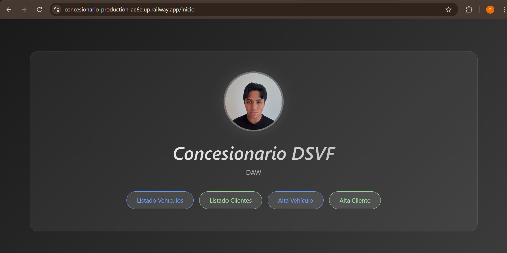
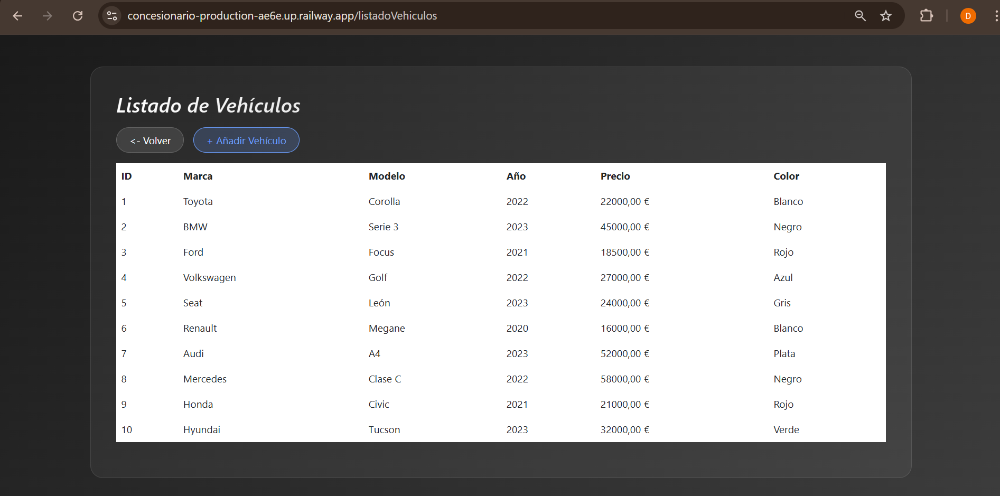
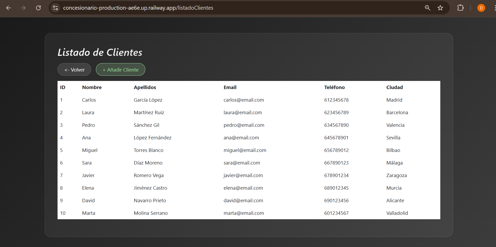
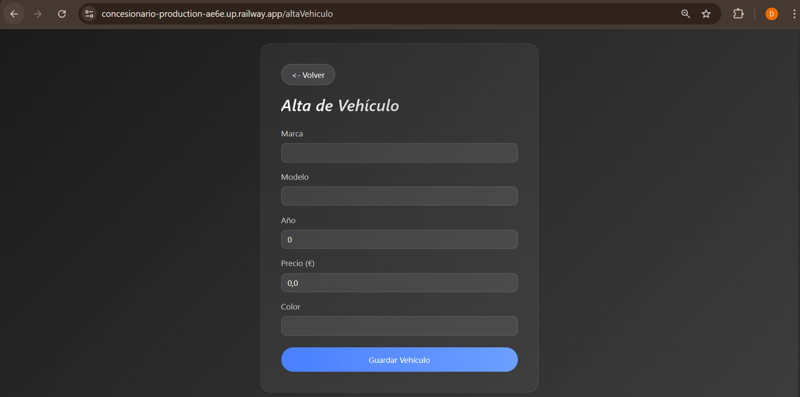
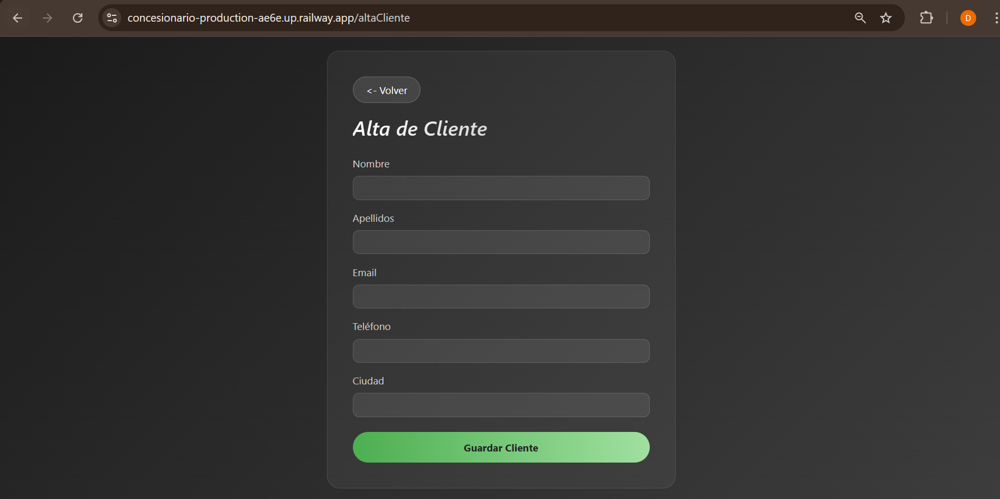

# Concesionario — Gestión de Vehículos y Clientes

Aplicación web desarrollada con Spring Boot, JPA/Hibernate, Thymeleaf y MySQL 
para gestionar vehículos y clientes de un concesionario.

## URL en producción
https://concesionario-production-ae6e.up.railway.app

## Requisitos previos
- Java 17
- MySQL 8.0+
- Maven 3.8+
- Spring Boot 3.2.5

## Pasos para ejecutarlo localmente

1. Clonar el repositorio:
   git clone https://github.com/DavidS-cyber(Usuario)/concesionario.git

2. Ejecutar el script SQL:
   mysql -u root -p < schema.sql

3. Configurar application.properties con tu usuario y contraseña MySQL

4. Ejecutar la aplicación:
   mvn spring-boot:run

5. Abrir en el navegador: http://localhost:8080/inicio

##  Capturas de pantalla

### Página de inicio

### Listado de Vehículos

### Listado de Clientes

### Alta de Vehículo

### Alta de Cliente

## Endpoints disponibles
- GET /inicio          → Página principal
- GET /listadoVehiculos → Tabla de vehículos
- GET /listadoClientes  → Tabla de clientes
- GET/POST /altaVehiculo → Formulario alta vehículo
- GET/POST /altaCliente  → Formulario alta cliente